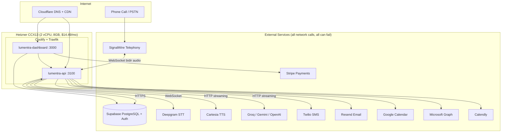
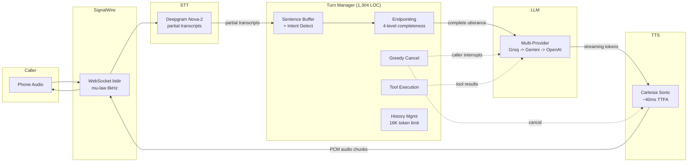
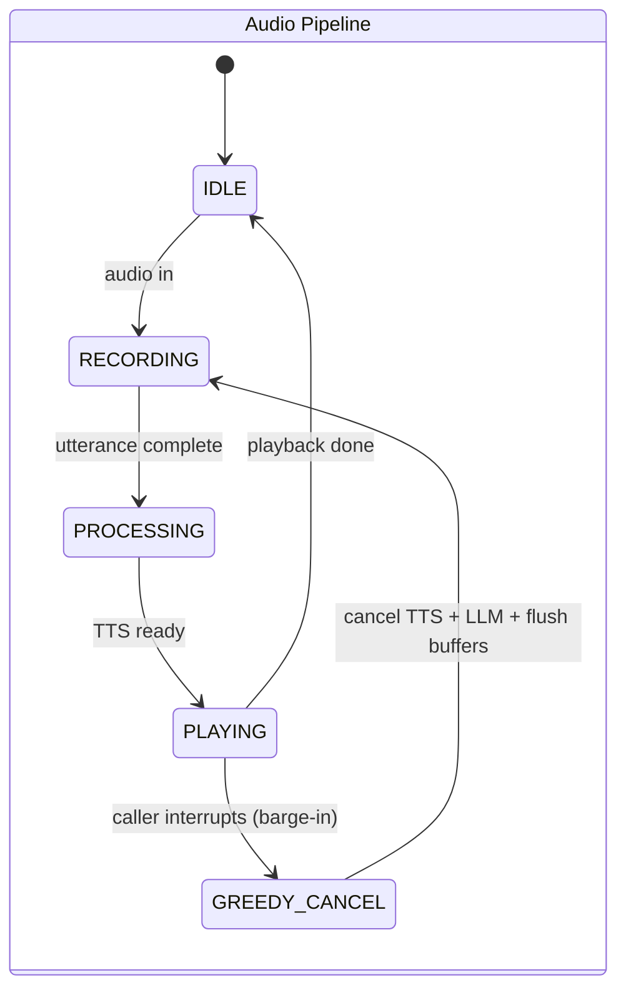
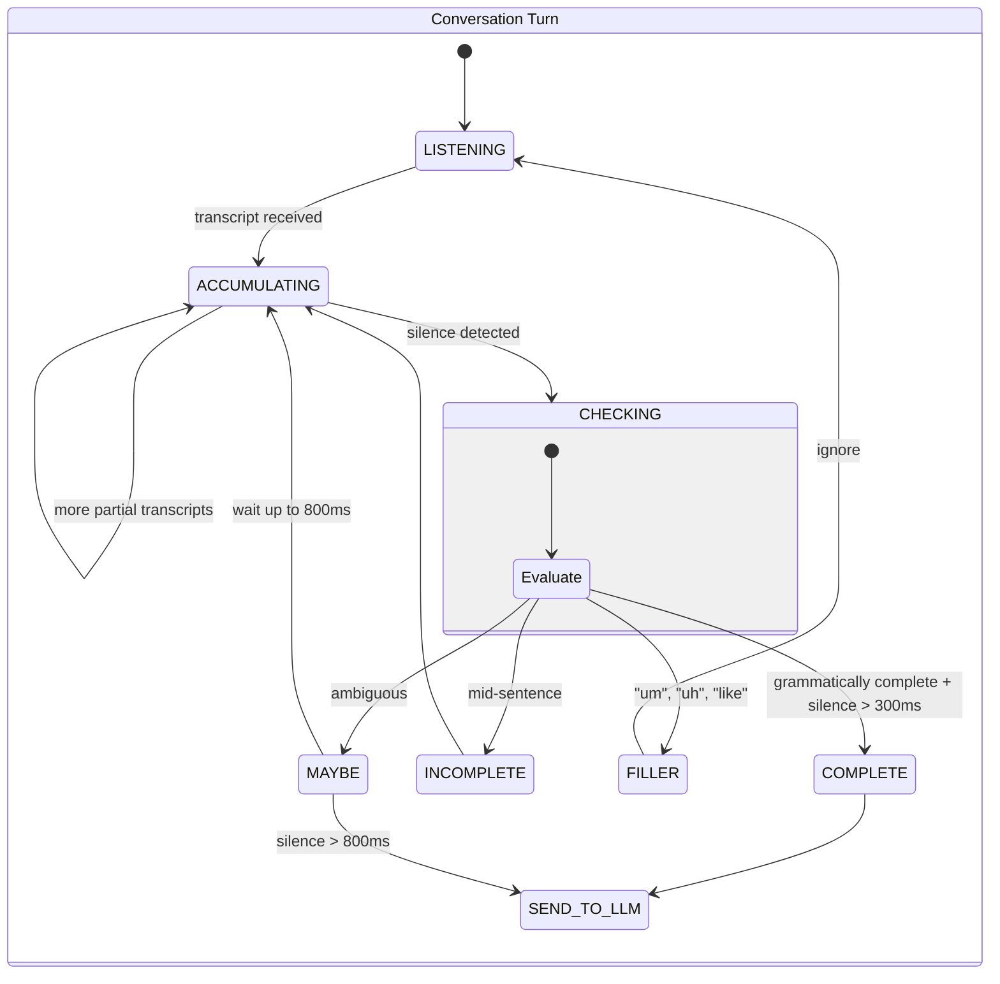
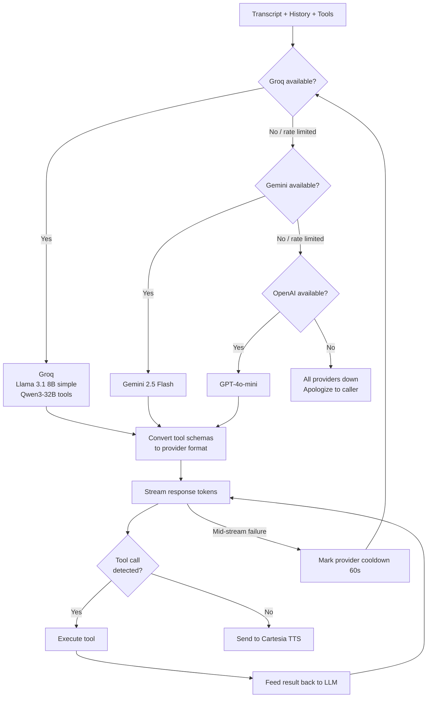
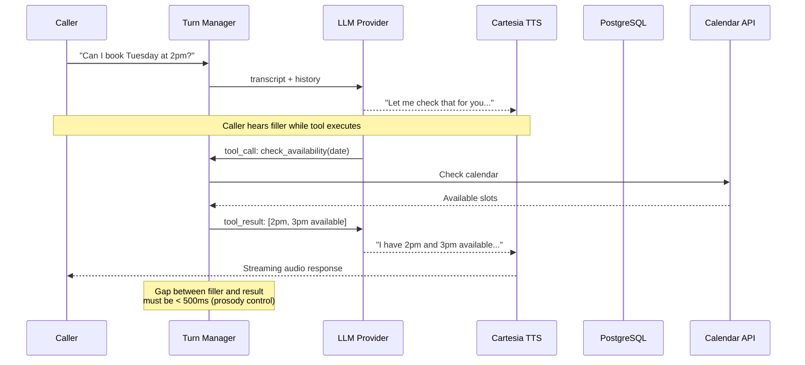
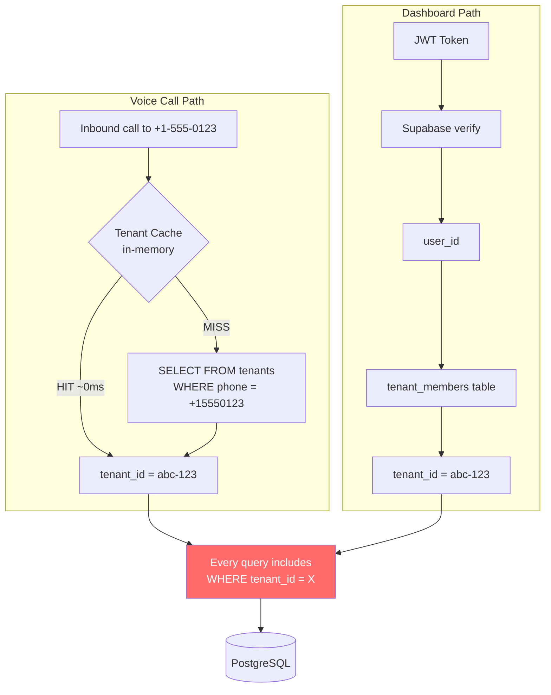
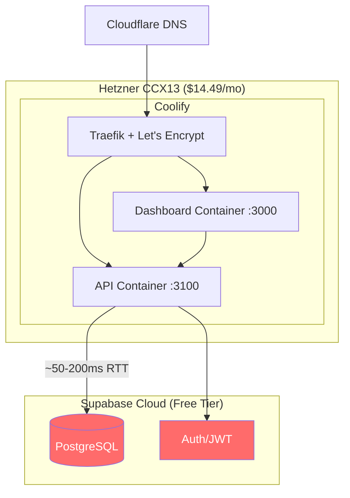

# Lumentra - Developer Handoff

**Last Updated:** 2026-02-04 | **Status:** Production, active development | **Complexity:** 4/5

---

## Product Summary

White-label SaaS: AI voice agents handle inbound business calls across 27 industries. Sub-500ms voice-to-voice latency via full-pipeline streaming. Cost: $0.02-0.04/min (vs. $0.15-0.20/min competitors like Vapi).

| Metric              | Value   |
| ------------------- | ------- |
| Backend TS files    | 102     |
| Backend LOC         | ~16,000 |
| Frontend components | 50+     |
| API route files     | 20      |
| DB migrations       | 15      |
| Industry configs    | 27      |

---

## Developer Profile Required

**Minimum:** 1 senior full-stack TypeScript engineer with WebSocket/streaming experience.

**Ideal: 2 engineers**

| Role                  | Focus                                   | Key Skills                                                                 | Priority |
| --------------------- | --------------------------------------- | -------------------------------------------------------------------------- | -------- |
| Backend/Voice         | Turn-manager, LLM providers, SignalWire | WebSocket bidirectional, real-time audio, state machines, LLM tool calling | Critical |
| Frontend/Integrations | Dashboard, calendar, CRM, API routes    | React 19/Next.js 16, OAuth flows, REST APIs                                | Critical |

Additional needs: Docker/Coolify/Hetzner admin knowledge, prompt engineering + multi-provider LLM experience.

---

## Tech Stack

| Layer             | Technology                             | Notes                                   |
| ----------------- | -------------------------------------- | --------------------------------------- |
| Backend framework | Hono.js on Node 20+                    | TS 5.7, esbuild                         |
| Database          | PostgreSQL (Supabase cloud, free tier) | Raw SQL via `pg` driver, NO ORM         |
| Auth              | Supabase JWT                           | Still dependent, migration incomplete   |
| Frontend          | Next.js 16 App Router, React 19        | shadcn/ui, TailwindCSS 4, Framer Motion |
| State management  | React Context                          | No Redux/Zustand                        |
| Logging           | Pino (structured JSON)                 | No Sentry/error monitoring              |

### Voice Pipeline Services

| Service          | Provider                        | Protocol          | Latency     | Purpose                        |
| ---------------- | ------------------------------- | ----------------- | ----------- | ------------------------------ |
| Telephony        | SignalWire                      | WebSocket (bidir) | -           | Inbound calls, audio transport |
| STT              | Deepgram Nova-2 (phonecall)     | WebSocket         | ~150ms      | Speech-to-text                 |
| LLM (primary)    | Groq (Llama 3.1 8B / Qwen3-32B) | HTTP streaming    | ~150ms TTFT | Response generation            |
| LLM (fallback 1) | Google Gemini 2.5 Flash         | HTTP streaming    | ~200ms TTFT | Fallback                       |
| LLM (fallback 2) | OpenAI GPT-4o-mini              | HTTP streaming    | ~300ms TTFT | Fallback                       |
| TTS              | Cartesia Sonic                  | HTTP streaming    | ~40ms TTFA  | Text-to-speech                 |

### Other External Dependencies

| Service             | Purpose                            |
| ------------------- | ---------------------------------- |
| Twilio              | SMS notifications only (not calls) |
| Resend              | Transactional email                |
| Stripe              | Payments/subscriptions             |
| Google Calendar API | Calendar sync                      |
| Microsoft Graph API | Outlook calendar sync              |
| Calendly API        | Calendar sync                      |
| Cloudflare          | DNS + CDN + DDoS                   |

---

## System Architecture



**Single points of failure:** 1 server (no redundancy), 1 database (Supabase free tier, 500MB limit), no load balancer, no auto-scaling. Server down = all calls fail.

---

## Voice Call Pipeline



**All streams run concurrently.** No component waits for the previous to finish. Total pipeline latency: < 500ms.

---

## Turn-Manager State Machine

The most critical file in the codebase. Two interlocked state machines running simultaneously.





### Endpointing Thresholds (tuned via live call testing)

| Condition                           | Action                 | Risk if wrong             |
| ----------------------------------- | ---------------------- | ------------------------- |
| Silence > 800ms                     | Send to LLM regardless | N/A (safety net)          |
| Complete sentence + silence > 300ms | Send to LLM            | Too low = cuts off caller |
| Filler words only                   | Ignore completely      | Miss actual speech        |
| Incomplete + < 800ms                | Keep accumulating      | Too high = slow response  |

---

## LLM Provider Fallback



**Hidden complexity:** Mid-stream provider failure means partial audio already sent to caller. Cannot unsay it. Must recover gracefully or generate recovery message.

### Tool Schema Sync Requirement

Each provider uses different tool schema formats for identical capabilities:

| Provider | Format                             | File                       | LOC |
| -------- | ---------------------------------- | -------------------------- | --- |
| Groq     | OpenAI-compatible function calling | `services/groq/tools.ts`   | 626 |
| Gemini   | Google FunctionDeclaration         | `services/gemini/tools.ts` | 624 |

**These MUST stay in sync.** Adding/modifying a tool = update both files.

---

## Tool Execution During Calls



Available tools: `create_booking`, `check_availability`, `get_business_info`, `escalate_to_human`, `check_caller_history`

---

## Multi-Tenant Architecture



**NO database-level RLS.** Tenant isolation is application-layer only. Missing `tenant_id` filter on ANY query = cross-tenant data leak.

---

## Code Complexity Ratings

### 5/5 - Do Not Touch Without Deep Understanding

| File                                 | LOC   | Why                                                                                                                                                                   |
| ------------------------------------ | ----- | --------------------------------------------------------------------------------------------------------------------------------------------------------------------- |
| `services/voice/turn-manager.ts`     | 1,304 | Real-time voice orchestration, 7+ timing thresholds, greedy cancel, endpointing, tool execution with prosody, history trimming. Single wrong change breaks all calls. |
| `services/llm/multi-provider.ts`     | 588   | 3-provider fallback chain, different APIs/schemas/streaming behaviors, health tracking, rate limit cooldowns                                                          |
| `services/llm/streaming-provider.ts` | 543   | Streaming LLM + simultaneous tool calling, sentence boundary detection for TTS timing, tool result injection                                                          |

### 4/5 - Complex, Careful Changes Only

| File                                  | LOC  | Why                                                                                   |
| ------------------------------------- | ---- | ------------------------------------------------------------------------------------- |
| `services/signalwire/media-stream.ts` | 223  | Bidirectional WebSocket audio, mu-law/linear16 encoding conversion, silence injection |
| `services/cartesia/tts.ts`            | ~200 | Streaming TTS, timing-sensitive audio generation                                      |
| `services/gemini/tools.ts`            | 624  | Tool definitions (must sync with groq/tools.ts)                                       |
| `services/groq/tools.ts`              | 626  | Tool definitions (must sync with gemini/tools.ts)                                     |
| `config/master-voice-prompt.ts`       | 449  | Agent personality/behavior prompt. Changes affect all calls. Test with live calls.    |

### 3/5 - Standard Backend

| Area                   | LOC    | Description                                                    |
| ---------------------- | ------ | -------------------------------------------------------------- |
| `services/database/`   | 848    | PG pool, query helpers, tenant cache                           |
| `services/calendar/`   | ~600   | Google/Outlook/Calendly OAuth integrations                     |
| `services/escalation/` | ~300   | Call transfer routing logic                                    |
| `services/bookings/`   | ~300   | CRUD + conflict checking + notifications                       |
| `routes/` (20 files)   | ~9,263 | REST endpoints. Largest: `contacts.ts` (940), `setup.ts` (673) |

### 2/5 - Straightforward

`services/contacts/`, `services/notifications/`, `services/chat/`, `middleware/`, `jobs/`, dashboard components

---

## Project Structure

```
lumentra-api/
  index.ts                    # Hono server entry, port 3100
  config/
    master-voice-prompt.ts    # 449-line agent personality prompt
    industry-prompts.ts       # 27 industry configs
  middleware/
    auth.ts                   # Supabase JWT verification
    rate-limit.ts             # IP-based rate limiting
  routes/                     # 20 REST endpoint files
  services/
    voice/
      turn-manager.ts         # THE critical file (1,304 LOC)
      session-manager.ts      # Active call session tracking
      sentence-buffer.ts      # Partial transcript accumulation
      conversation-state.ts   # Call lifecycle states
      audio-pipeline-state.ts # Audio system state machine
      intent-detector.ts      # Caller intent classification
      voicemail.ts            # Voicemail detection/recording
    llm/
      multi-provider.ts       # 3-provider fallback (588 LOC)
      streaming-provider.ts   # Streaming + tool calling (543 LOC)
    gemini/                   # tools.ts, chat.ts, streaming.ts
    groq/                     # tools.ts, chat.ts, streaming.ts
    deepgram/                 # STT integration
    cartesia/                 # TTS integration
    signalwire/               # Telephony + WebSocket audio
    database/                 # PG pool, query helpers, tenant cache
    calendar/                 # Google, Outlook, Calendly OAuth
    bookings/                 # Appointment CRUD
    escalation/               # Human transfer logic
    contacts/                 # CRM operations
    notifications/            # Email (Resend) + SMS (Twilio)
    chat/                     # Web chat widget
    training/                 # Conversation logger for fine-tuning
  types/                      # TS interfaces
  jobs/                       # Cron jobs (reminders, availability, scores)
  schema/                     # 001-tables.sql, 002-indexes.sql, 003-functions.sql
  migrations/                 # 15 incremental migration files

lumentra-dashboard/
  app/
    (marketing)/              # Public landing pages
    (auth)/                   # Login/signup (Supabase auth)
    setup/                    # Multi-step onboarding wizard
    (dashboard)/              # Protected pages (calls, bookings, contacts, settings)
    (checkout)/               # Stripe payment flows
  components/                 # 50+ React components
  lib/
    api/                      # Backend API client
    supabase/                 # Auth utilities
    stripe/                   # Payment helpers
    industry-presets.ts       # 27 industry default configs
```

---

## Database Schema (Key Tables)

All tables use UUID PKs (`uuid-ossp`). All include `tenant_id`. No RLS - app-layer filtering only.

| Table                 | Purpose                   | Key Fields                                                                                                                                     |
| --------------------- | ------------------------- | ---------------------------------------------------------------------------------------------------------------------------------------------- |
| `tenants`             | Business config (central) | industry, phone, agent_personality (JSONB), voice_config (JSONB), greetings, operating_hours (JSONB), feature_flags (JSONB), subscription_tier |
| `contacts`            | CRM                       | phone (original + normalized), engagement metrics, lead_status, sentiment_average                                                              |
| `calls`               | Call records              | direction, status, duration, outcome, sentiment, intents[], transcript (JSONB), recording_url                                                  |
| `bookings`            | Appointments              | date, time, type, status (pending/confirmed/rejected/cancelled), confirmation_code                                                             |
| `conversations`       | Message-level data        | role, content, tool_calls (JSONB), token_usage                                                                                                 |
| `tenant_members`      | User-tenant mapping       | role (owner/admin/member)                                                                                                                      |
| `tenant_integrations` | OAuth credentials         | provider, access_token, refresh_token, expires_at                                                                                              |
| `escalation_contacts` | Human transfer targets    | phone, email, availability_windows, preferred_method                                                                                           |

---

## Known Issues

| Issue                              | Severity | Description                                                                |
| ---------------------------------- | -------- | -------------------------------------------------------------------------- |
| OAuth tokens in plaintext          | High     | Calendar OAuth credentials stored unencrypted in DB                        |
| No test suite                      | Medium   | Zero unit/integration/e2e tests. All testing is manual.                    |
| Call transfer not implemented      | Medium   | Placeholder only. Escalation gives contact info instead of SIP transfer    |
| Outbound callbacks not implemented | Medium   | DB/job infrastructure exists, SignalWire outbound call initiation missing  |
| Auth depends on Supabase           | Low      | DB queries migrated to direct PG, but JWT verification still uses Supabase |
| No error monitoring                | Medium   | No Sentry/Datadog. Errors go to stdout via Pino only                       |

---

## Breakage Warnings

| Area                           | What Breaks                                               | Why                                                                                                |
| ------------------------------ | --------------------------------------------------------- | -------------------------------------------------------------------------------------------------- |
| Turn-manager timing thresholds | Call quality (AI cuts off callers or responds too slowly) | Values tuned through extensive live testing. Even 100ms off ruins experience.                      |
| LLM tool schema sync           | Inconsistent AI behavior during provider fallback         | `gemini/tools.ts` and `groq/tools.ts` must define identical capabilities                           |
| Audio encoding                 | Static, silence, or distorted audio                       | SignalWire = mu-law 8kHz, Deepgram = linear16, Cartesia = PCM. Conversion in `media-stream.ts`     |
| Tenant cache invalidation      | Cross-tenant data exposure                                | Phone-to-tenant mapping cached in memory. Config changes without cache invalidation = wrong tenant |
| History token trimming         | Context overflow crashes calls, or LLM loses context      | Must preserve system message, recent turns, and complete tool call chains (request + result pairs) |
| Master voice prompt            | All calls sound different/wrong                           | 449-line carefully engineered prompt. Test with live calls before deploying changes.               |

---

## Environment Variables

| Category | Variables                                                                                                       | Required            |
| -------- | --------------------------------------------------------------------------------------------------------------- | ------------------- |
| Database | `SUPABASE_URL`, `SUPABASE_ANON_KEY`, `SUPABASE_SERVICE_ROLE_KEY`                                                | Yes                 |
| LLM      | `GROQ_API_KEY`, `GEMINI_API_KEY`, `OPENAI_API_KEY`, `LLM_PROVIDER`                                              | At least 1 provider |
| Voice    | `DEEPGRAM_API_KEY`, `CARTESIA_API_KEY`, `SIGNALWIRE_PROJECT_ID`, `SIGNALWIRE_API_TOKEN`, `SIGNALWIRE_SPACE_URL` | All for calls       |
| Server   | `PORT` (3100), `BACKEND_URL` (public URL for webhooks), `NODE_ENV`                                              | Yes                 |
| Frontend | `NEXT_PUBLIC_API_URL`, `DEFAULT_TENANT_ID`                                                                      | Yes                 |

---

## Local Development

1. `npm install` in both `lumentra-api/` and `lumentra-dashboard/`
2. `npm run dev` in each (API on :3100, Dashboard on :3000)
3. For voice calls: tunnel API via ngrok, set `BACKEND_URL` to public ngrok URL, configure in SignalWire webhook
4. Alternative: `docker compose up` from project root

---

## Deployment

Single Hetzner CCX13 (2 vCPU, 8GB RAM, 80GB + 10GB volume) in Ashburn, VA. Managed by Coolify (Traefik reverse proxy, Let's Encrypt SSL). Database on Supabase cloud (not on server - all queries over internet, ~50-200ms RTT).



---

## Recent Development (Last 30 Days)

- Complete turn-taking rewrite: Vapi-inspired greedy cancel + layered endpointing (replaced simple timeout approach)
- Audio pipeline state machine refactor: eliminated race conditions between record/process/play
- Tool result prosody fix: eliminated pause between tool use and spoken result
- Conversation history trimming fix: preserved tool call chain integrity
- Multi-provider LLM fallback chain: replaced single-provider approach
- Database migration: Supabase client -> direct `pg` driver (40+ files)
- Barge-in tuning: reduced false positives from background noise/filler words
